# Patricia Frontend


Red social académica y de entretenimiento para estudiantes universitarios. Conecta usuarios con intereses similares, facilita la creación de grupos de estudio y entretenimiento (Parches), y proporciona recomendaciones inteligentes basadas en perfiles.

---

##  Índice

1. [Descripción del proyecto](#descripción-del-proyecto)
2. [Equipo](#equipo)
3. [Estándares técnicos](#estándares-técnicos)
4. [Primeros pasos](#primeros-pasos)
5. [Scripts disponibles](#scripts-disponibles)
6. [Arquitectura del proyecto](#arquitectura-del-proyecto)
7. [Diagrama de navegación](#diagrama-de-navegación)
8. [Cómo funciona el aplicativo](#cómo-funciona-el-aplicativo)
9. [Módulos funcionales](#módulos-funcionales)
10. [Módulos de backend por funcionalidad](#módulos-de-backend-por-funcionalidad)
11. [Video / Demo por funcionalidad](#video--demo-por-funcionalidad)
12. [Diagrama de componentes a gran escala](#diagrama-de-componentes-a-gran-escala)
13. [Evidencia de pruebas funcionales](#evidencia-de-pruebas-funcionales)
14. [Mockups y diseño](#mockups-y-diseño)
15. [Decisiones técnicas](#decisiones-técnicas)
16. [Convenciones de código](#convenciones-de-código)
17. [Gestión de estado](#gestión-de-estado)
18. [Integración con API](#integración-con-api)
19. [Pruebas](#pruebas)
20. [Performance y optimización](#performance-y-optimización)
21. [Variables de entorno](#variables-de-entorno)
22. [Conexiones con servicios externos](#conexiones-con-servicios-externos)
23. [Deployment y CI/CD](#deployment-y-cicd)
24. [Contribuir](#contribuir)

---

## Descripción del proyecto

Patricia  es una plataforma integral diseñada para resolver la fragmentación de conexiones estudiantiles en universidades. Los estudiantes actuales enfrentan dificultades para encontrar compañeros con intereses similares, formar grupos de estudio efectivos y participar en actividades extracurriculares organizadas. Nuestra solución automatiza el emparejamiento de usuarios ("Perfect Matches") y ofrece gestión administrativa centralizada de grupos o "Parches", creando un ecosistema de conexión académica y social.

---

## Equipo

Desarrollado por estudiantes de la Escuela Colombiana de Ingeniería Julio Garavito como proyecto académico.

| Nombre | Rol |
|--------|-----|
| Fabian Andrade | Desarrollador Frontend |
| Andres Pineda | Desarrollador Frontend |
| Mariana Malagón | Desarrollador Frontend |
| Juan Gomez | Desarrollador Frontend |
| Stiven Pardo | Desarrollador Frontend |
| Santiago Cajamarca | Desarrollador Frontend |

---

## Estándares técnicos

**Stack tecnológico**
- **Frontend:** React 18 con TypeScript 5.0
- **Build tool:** Vite 4.0
- **Styling:** Tailwind CSS
- **Routing:** React Router
- **Runtime:** Node.js 16+

**Características de desarrollo**
- Tipado estático completo con TypeScript
- Componentes funcionales con Hooks
- Linting automático y validación de código
- Formateo consistente
- Build optimizado para producción

---

## Primeros pasos

### Requisitos previos

- Node.js 16 o superior
- npm 8 o superior (o yarn/pnpm)

### Instalación

```bash
git clone <repository-url>
cd patricia-frontend
npm install
```

### Desarrollo local

```bash
npm run dev
```

La aplicación estará disponible en `http://localhost:5173` (puerto por defecto de Vite).

---

## Scripts disponibles

```bash
npm run dev       # Ejecutar servidor de desarrollo
npm run build     # Compilar para producción
npm run preview   # Visualizar build de producción localmente
npm run lint      # Ejecutar ESLint para validación de código
npm run format    # Formatear código con Prettier
npm run test      # Ejecutar suite de pruebas (si aplica)
npm run type-check # Validar tipos TypeScript
```

---

## Arquitectura del proyecto

```
src/
├── components/          # Componentes reutilizables
│   ├── auth/           # Componentes de autenticación
│   ├── dashboard/      # Componentes del dashboard
│   ├── parcha/         # Componentes de gestión de parchas
│   ├── profile/        # Componentes de perfil de usuario
│   └── common/         # Componentes comunes (header, footer, etc.)
├── pages/              # Páginas principales
├── hooks/              # Custom hooks
├── services/           # Servicios API
├── context/            # Context API para estado global
├── types/              # Definiciones de tipos TypeScript
├── styles/             # Estilos globales
├── utils/              # Funciones utilitarias
└── App.tsx             # Componente raíz
```

---

## Diagrama de navegación

El siguiente diagrama describe el flujo de navegación entre las pantallas principales del aplicativo:

```
[Landing / Login]
       │
       ├──► [Registro] ──► [Verificación de correo] ──► [Perfil académico] ──► [Selección de intereses]
       │
       └──► [Dashboard] ──────────────────────────────────────────────────────┐
                │                                                              │
                ├──► [Perfect Matches]  (recomendaciones de usuarios)         │
                │                                                              │
                ├──► [University Pulse] (actividad de la comunidad)           │
                │                                                              │
                ├──► [Parches]                                                 │
                │         ├──► [Catálogo de Parches]                          │
                │         ├──► [Detalle de Parches]                            │
                │         └──► [Crear Parches]                                 │
                │                                                              │
                ├──► [Perfil de usuario]                                       │
                │         ├──► [Milestones / Logros]                          │
                │         └──► [Editar perfil]                                │
                │                                                              │
                └──► [Mapa / Geolocalización] ◄────────────────────────────┘
```

**Flujo principal:**
1. El usuario ingresa por Login o se registra.
2. Al registrarse, pasa por verificación de correo, configuración académica y selección de intereses.
3. Una vez autenticado, accede al Dashboard como pantalla central.
4. Desde el Dashboard puede navegar libremente entre Parchas, Perfil y el Mapa de eventos.
5. La recuperación de contraseña es accesible desde la pantalla de Login.

---

## Cómo funciona el aplicativo

Patricia funciona como una red social académica con los siguientes flujos principales:

**1. Registro y onboarding**
- El estudiante se registra con su correo institucional.
- Verifica su cuenta, completa su perfil académico y selecciona sus intereses.
- El sistema genera su perfil base para el algoritmo de matching.

**2. Perfect Matches**
- El algoritmo cruza los intereses, carrera y semestre del usuario con los demás perfiles.
- Se muestran recomendaciones ordenadas por compatibilidad.
- El usuario puede enviar solicitudes de conexión.

**3. Parches**
- Cualquier usuario puede crear una Parcha (grupo), categorizándola como Académica, Social o Deportiva.
- Los demás usuarios pueden buscar, filtrar y solicitar unirse.
- El creador administra los miembros y actividades del grupo.

**4. Geolocalización**
- El mapa muestra eventos activos dentro del campus.
- El usuario puede activar su ubicación para ver eventos cercanos.
- Los eventos se filtran por categoría y distancia.

**5. Perfil y progreso social**
- Cada acción en la plataforma genera puntos de experiencia (XP).
- Los logros y milestones se desbloquean conforme el usuario participa.

---

## Módulos funcionales

### 1. Módulo de autenticación

Gestiona el ingreso y registro de usuarios con múltiples opciones de autenticación.

**Funcionalidades:**
- Registro con correo electrónico
- Inicio de sesión con credenciales
- Recuperación de contraseña
- Control de acceso a funcionalidades del sistema

**Paso a paso:**
1. El usuario accede a la pantalla de Login.
2. Si no tiene cuenta, hace clic en "Registrarse" y completa el formulario.
3. Recibe un correo de verificación y valida su cuenta.
4. Completa su perfil académico (carrera, semestre, universidad).
5. Selecciona sus intereses para activar el algoritmo de matching.
6. Si olvidó su contraseña, usa el flujo de recuperación por correo.


*Login screen - Platform access*


*Registration screen - New account creation*


*Academic profile screen - Basic academic information*


*Password recovery screen - Instructions request*


---

### 2. Módulo de dashboard

Vista principal personalizada que proporciona recomendaciones y visibilidad de la comunidad.

**Funcionalidades:**
- Recomendaciones de estudiantes ("Perfect Matches") basadas en intereses
- Feed de actividades de la comunidad ("University Pulse")
- Accesos rápidos a funcionalidades principales
- Resumen de información relevante del usuario

**Paso a paso:**
1. Al iniciar sesión, el usuario ve su Dashboard personalizado.
2. La sección "Perfect Matches" muestra perfiles compatibles con opción de conectar.
3. "University Pulse" muestra actividad reciente: nuevas parchas, eventos y conexiones.
4. Desde aquí puede navegar a cualquier módulo con un clic.

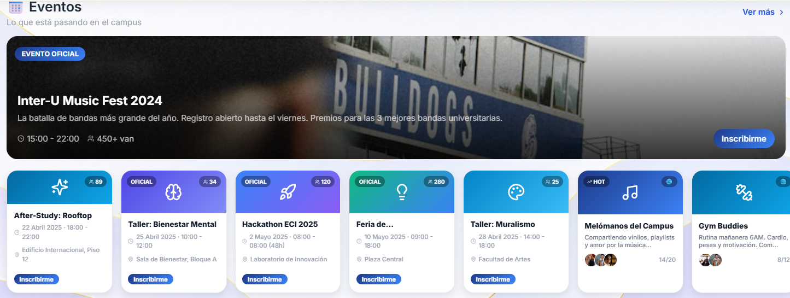
*Main view - Recommendations and community activity*

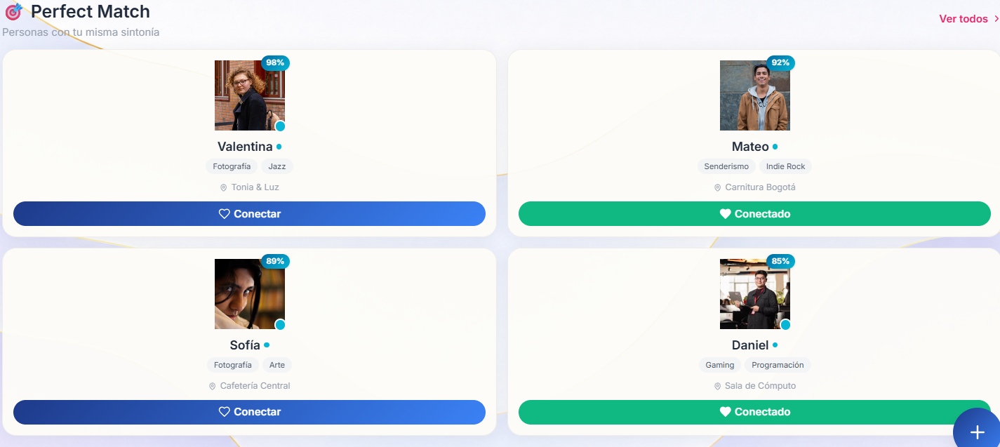
*Perfect Matches section - Suggested connections*


---

### 3. Módulo de gestión de parches

Permite crear, visualizar, buscar y unirse a grupos de estudio y entretenimiento.

**Funcionalidades:**
- Crear nuevas parchas con categorización (Académicas, Sociales, Deportes)
- Visualizar listado de parchas disponibles
- Detalles de cada parcha (miembros, descripción, actividades)
- Buscar y filtrar parchas por categoría e intereses
- Sistema de solicitud para unirse a parchas

**Paso a paso:**
1. El usuario navega al catálogo de Parchas.
2. Puede filtrar por categoría (Académica, Social, Deportiva) o buscar por nombre.
3. Al hacer clic en una Parcha, ve su detalle: descripción, miembros y actividades.
4. Puede solicitar unirse enviando una solicitud al administrador.
5. Para crear una Parcha, llena el formulario con nombre, categoría, descripción y configuración de privacidad.


*Patch catalog - Search and discovery*


*Detail view - Member information and activities*


*Creation form - New patch configuration*

---

### 4. Módulo de perfil

Visualización y edición del perfil de usuario con seguimiento de progreso social.

**Funcionalidades:**
- Información completa del perfil
- Social Progress: puntos de experiencia (XP) y eventos asistidos
- Historial de clubes y parchas
- Logros y milestones alcanzados
- Galería de fotos y multimedia
- Edición de preferencias e intereses

**Paso a paso:**
1. El usuario accede a su perfil desde el menú principal.
2. Visualiza su XP acumulado, eventos asistidos y parchas activas.
3. En la sección "Milestones" ve los logros desbloqueados y los que le faltan.
4. Puede editar su información personal, académica e intereses desde el formulario de edición.


*Main profile view - Information and basic statistics*


*Milestones section - Unlocked achievements*


*Edit form - Information update*

---

### 5. Módulo de geolocalización

Herramienta de mapeo que permite visualizar y gestionar eventos en la universidad de forma espacial.

**Funcionalidades:**
- Visualización interactiva de eventos en el mapa de la universidad
- Activar/desactivar geolocalización para ver tu ubicación actual
- Vista de eventos activos cercanos a tu ubicación

**Paso a paso:**
1. El usuario accede al mapa desde el menú principal.
2. Ve los eventos activos del campus representados con marcadores en el mapa.
3. Activa su geolocalización para ver su posición actual.
4. Filtra eventos por categoría o distancia.
5. Al hacer clic en un marcador, ve los detalles del evento.

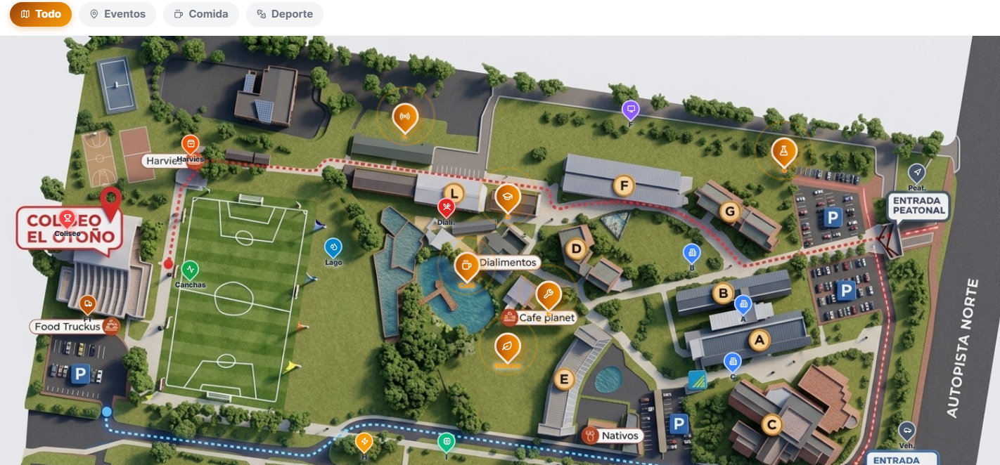
*Event map - Interactive university visualization*

---

## Módulos de backend por funcionalidad

| Funcionalidad | Módulo de Backend | Endpoint principal |
|---------------|-------------------|--------------------|
| Registro / Login | Auth Service | `POST /api/auth/register`, `POST /api/auth/login` |
| Verificación de correo | Auth Service | `POST /api/auth/verify-email` |
| Recuperación de contraseña | Auth Service | `POST /api/auth/forgot-password` |
| Perfect Matches | Matching Service | `GET /api/matches/recommendations` |
| University Pulse | Feed Service | `GET /api/feed/pulse` |
| Listado de Parchas | Parcha Service | `GET /api/parchas` |
| Detalle de Parcha | Parcha Service | `GET /api/parchas/:id` |
| Crear Parcha | Parcha Service | `POST /api/parchas` |
| Unirse a Parcha | Parcha Service | `POST /api/parchas/:id/join` |
| Perfil de usuario | User Service | `GET /api/users/:id` |
| Editar perfil | User Service | `PUT /api/users/:id` |
| Milestones / XP | Gamification Service | `GET /api/users/:id/milestones` |
| Mapa de eventos | Geolocation Service | `GET /api/events/map` |

> **Nota:** Los endpoints indicados son los contratos definidos entre frontend y backend. Verificar disponibilidad según el estado del sprint actual.

---

## Video / Demo por funcionalidad

| Módulo | Link de Demo |
|--------|-------------|
| Autenticación (Login / Registro) | _Pendiente de publicación_ |
| Dashboard y Perfect Matches | _Pendiente de publicación_ |
| Gestión de Parchas | _Pendiente de publicación_ |
| Perfil y Milestones | _Pendiente de publicación_ |
| Mapa / Geolocalización | _Pendiente de publicación_ |

> Actualizar esta tabla con los links de los videos de demostración por funcionalidad una vez sean publicados.

---

## Diagrama de componentes a gran escala

```
┌─────────────────────────────────────────────────────────────────────┐
│                          App.tsx (Root)                             │
│                      AuthContext / AppContext                       │
└────────────────────────────┬────────────────────────────────────────┘
                             │
              ┌──────────────┼──────────────────┐
              │              │                  │
     ┌────────▼──────┐ ┌─────▼──────┐ ┌────────▼────────┐
     │  Auth Pages   │ │  Layout    │ │  Public Routes  │
     │  Login        │ │  Header    │ │  Landing        │
     │  Register     │ │  Footer    │ └─────────────────┘
     │  Verify       │ │  Sidebar   │
     │  Reset        │ └─────┬──────┘
     └───────────────┘       │
                    ┌────────┼──────────────────────────┐
                    │        │                          │
           ┌────────▼──┐ ┌───▼──────────┐ ┌────────────▼──────┐
           │ Dashboard │ │   Parches    │ │     Profile        │
           │ MatchCard │ │ ParchaList   │ │ ProfileHeader      │
           │ PulseCard │ │ ParchaDetail │ │ MilestoneCard      │
           │ QuickNav  │ │ ParchaForm   │ │ EditProfileForm    │
           └───────────┘ │ FilterBar    │ └───────────────────┘
                         └──────────────┘
                                │
                    ┌───────────▼───────────┐
                    │   Geolocation Map     │
                    │   MapContainer        │
                    │   EventMarker         │
                    │   FilterPanel         │
                    └───────────────────────┘

         ┌──────────────────────────────────────┐
         │              Services Layer           │
         │  authService  userService             │
         │  parchaService  matchService          │
         │  feedService  geoService              │
         └──────────────────────────────────────┘
```

---

## Evidencia de pruebas funcionales

> en proceso

**Pruebas realizadas:**

| Funcionalidad | Tipo de prueba | Estado |
|---------------|----------------|--------|
| Login con credenciales válidas | Manual / E2E | completado |
| Registro de nuevo usuario | Manual | completado |
| Visualización de Perfect Matches | Manual | completado |
| Creación de Parcha | Manual | completado |
| Unirse a una Parcha | Manual | completado |
| Edición de perfil | Manual | completado |
| Visualización del mapa | Manual | completado |
| Recuperación de contraseña | Manual | completado |

> Videos

---

## Mockups y diseño

Todos los mockups se encuentran en `docs/mockups/`. La siguiente es la estructura visual del proyecto según Sprint 4:

### Identidad visual

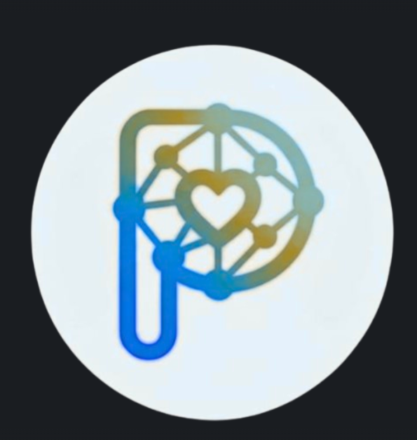

*Official logo of the Patrici.a  project*

[Revisar manual de identidad visual]
[text](https://www.figma.com/make/59CwVEOfPEh0XDaqZfEl3o/patrici.a?p=f&t=SEtbTLpGNxFXoOli-0&preview-route=%2Fcampus-map)

### Diseño en Figma
[Acceder al prototipo completo en Figma](https://figma.com/your-project-link)


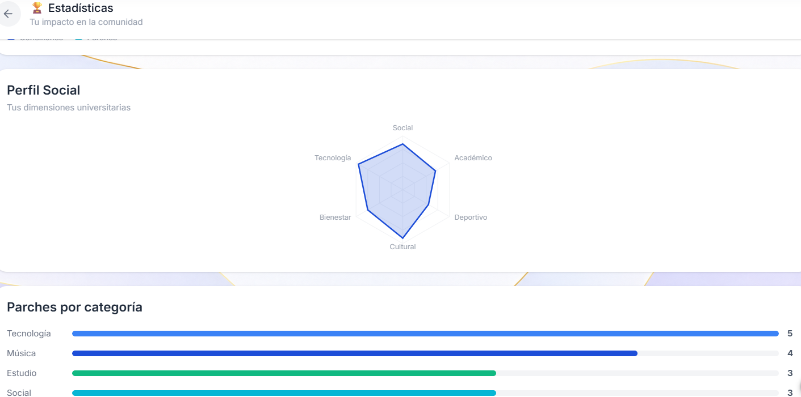
*estadisticas*

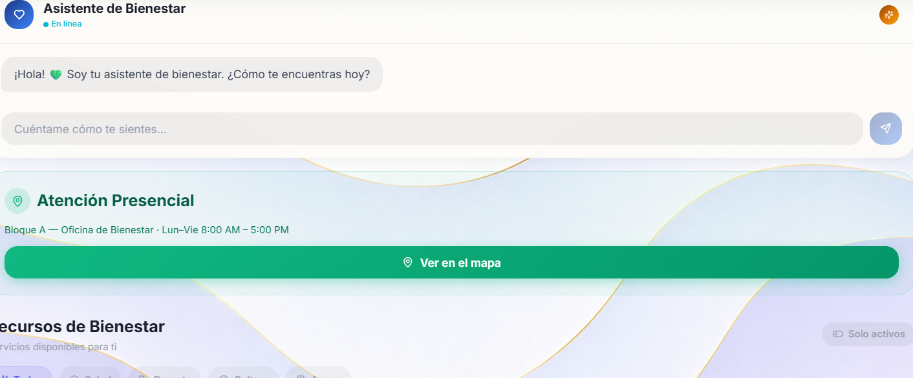
*binestar*

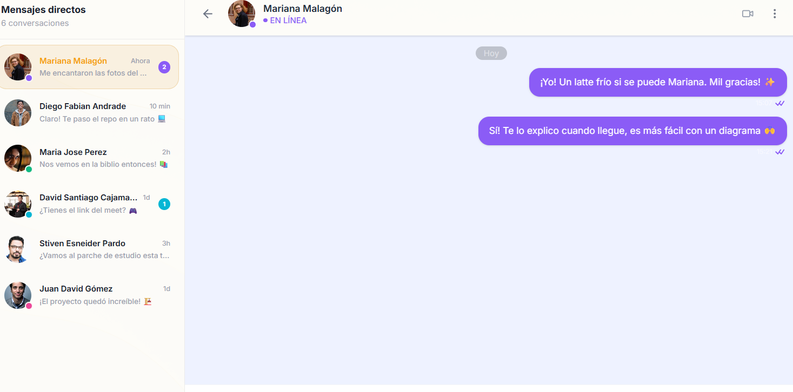
*chat*
---
## Caracteristica nuevas
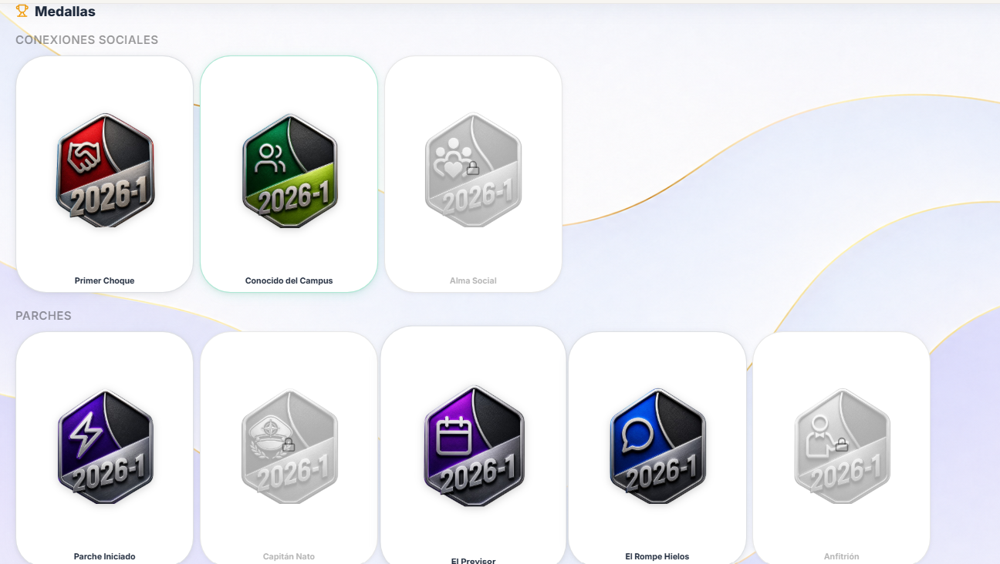
*sistema de medallas*  

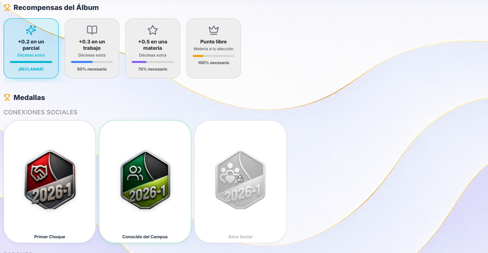
*recompensas por llenar el album*  

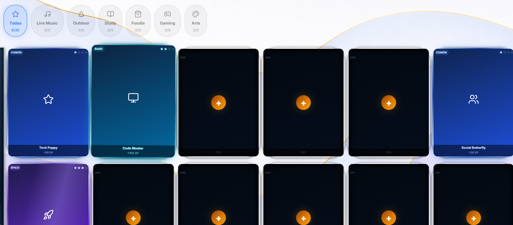
*sistema de monas*  

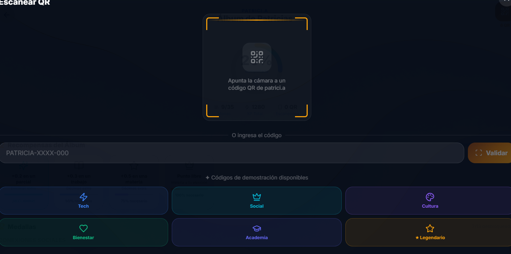
*escaneo de qr para aabrir monas*

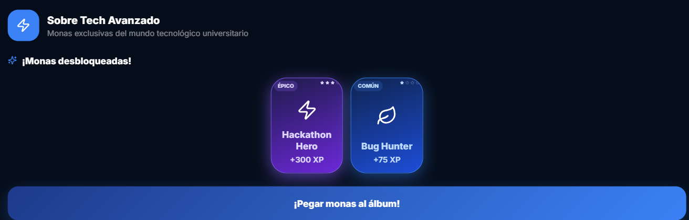
*desbloqueo de monas para pegarlas en el album*

---


## Decisiones técnicas

El proyecto utiliza tecnologías modernas de frontend para asegurar escalabilidad, mantenibilidad y rendimiento óptimo. Cada herramienta fue seleccionada basándose en las mejores prácticas de la industria.

---

## Convenciones de código

**Nombres de componentes:** PascalCase
```typescript
// ✓ Correcto
export const UserProfile = () => { }
export const NavigationBar = () => { }

// ✗ Incorrecto
export const userProfile = () => { }
```

**Nombres de archivos:** kebab-case para archivos, PascalCase para componentes
```
src/components/
├── user-profile.tsx      // archivo
├── UserProfile.tsx       // componente
├── hooks/
│   └── use-auth.ts       // custom hook
```

**Variables y funciones:** camelCase
```typescript
const userEmail = "";
const calculateTotalPrice = () => { }
```

**Constantes:** UPPER_SNAKE_CASE
```typescript
const API_BASE_URL = "https://api.example.com";
const MAX_RETRY_ATTEMPTS = 3;
```

**Imports organizados:**
```typescript
// 1. Librerías externas
import React, { useState } from 'react';
import { useNavigate } from 'react-router-dom';

// 2. Componentes locales
import { Header } from '@/components/common/Header';
import { UserCard } from '@/components/user/UserCard';

// 3. Hooks personalizados
import { useAuth } from '@/hooks/use-auth';

// 4. Servicios y utilidades
import { userService } from '@/services/user-service';
import { formatDate } from '@/utils/date-utils';

// 5. Tipos
import type { User } from '@/types/user';

// 6. Estilos
import styles from './component.module.css';
```

---

## Gestión de estado

Se recomienda utilizar una de las siguientes estrategias según la complejidad:

**Context API + Hooks:** Para estado global simple
```typescript
export const AuthContext = createContext<AuthContextType | undefined>(undefined);

export const useAuth = () => {
  const context = useContext(AuthContext);
  if (!context) {
    throw new Error('useAuth debe ser usado dentro de AuthProvider');
  }
  return context;
};
```

**Zustand o Redux Toolkit:** Para estado global complejo con múltiples acciones

---

## Integración con API

Los servicios API se centralizan en la carpeta `src/services/`. Utilizar Fetch API o Axios con gestión de errores:

```typescript
// src/services/user-service.ts
export const userService = {
  async getUser(id: string) {
    const response = await fetch(`${API_BASE_URL}/users/${id}`);
    if (!response.ok) throw new Error('Failed to fetch user');
    return response.json();
  },

  async updateUser(id: string, data: UserUpdatePayload) {
    const response = await fetch(`${API_BASE_URL}/users/${id}`, {
      method: 'PUT',
      headers: { 'Content-Type': 'application/json' },
      body: JSON.stringify(data),
    });
    if (!response.ok) throw new Error('Failed to update user');
    return response.json();
  },
};
```

---

## Pruebas

La suite de pruebas utiliza Vitest y React Testing Library:

```bash
npm run test              # Ejecutar todas las pruebas
npm run test:watch       # Modo watch
npm run test:coverage    # Cobertura de pruebas

```
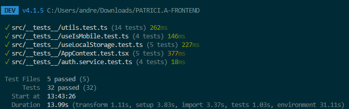

**Estructura de pruebas:**
```
src/
├── components/
│   ├── UserCard.tsx
│   └── __tests__/
│       └── UserCard.test.tsx
```

---

## Performance y optimización

- Lazy loading de rutas con `React.lazy()`
- Code splitting automático por Vite
- Optimización de imágenes (WebP, compresión)
- Memoización de componentes con `React.memo()` cuando sea necesario
- Eliminación de dependencias innecesarias en hooks

---

## Variables de entorno

Crear archivo `.env.local` en la raíz del proyecto:

```env
VITE_API_BASE_URL=http://localhost:8080/api
VITE_APP_NAME=Patricia
VITE_ENVIRONMENT=development
```

Acceder en el código:
```typescript
const apiUrl = import.meta.env.VITE_API_BASE_URL;
```

---

## Conexiones con servicios externos

| Servicio | Propósito | Configuración |
|----------|-----------|---------------|
| Backend REST API | Datos de usuarios, parchas, matches y eventos | `VITE_API_BASE_URL` en `.env.local` |
| Google Maps API | Visualización del mapa de campus y geolocalización | `VITE_MAPS_API_KEY` en `.env.local` |
| SMTP / Email Service | Verificación de correo y recuperación de contraseña | Gestionado por el backend |
| Vercel | Hosting y despliegue del frontend | Configurado vía `vercel.json` |

> Agregar aquí cualquier SDK de terceros adicional que se integre al proyecto (analytics, notificaciones push, etc.).

---

## Deployment y CI/CD

### Build para producción

```bash
npm run build
```

La carpeta `dist/` contiene los archivos compilados listos para producción.

### Opciones de hosting

- **Vercel** *(principal)* — [Link de despliegue](https://your-project.vercel.app) *(actualizar con URL real)*
- Netlify
- GitHub Pages
- AWS S3 + CloudFront
- Azure Static Web Apps

### Pipelines CI/CD

El proyecto cuenta con dos pipelines diferenciados:

#### Pipeline de Desarrollo (`develop` branch)

```yaml
# .github/workflows/ci-develop.yml
name: CI - Development

on:
  push:
    branches: [develop]
  pull_request:
    branches: [develop]

jobs:
  build-and-test:
    runs-on: ubuntu-latest
    steps:
      - uses: actions/checkout@v3
      - uses: actions/setup-node@v3
        with:
          node-version: '18'
      - run: npm install
      - run: npm run lint
      - run: npm run type-check
      - run: npm run test
      - run: npm run build
      - name: Deploy to Vercel (Preview)
        run: npx vercel --token=${{ secrets.VERCEL_TOKEN }}
```

#### Pipeline de Producción (`main` branch)

```yaml
# .github/workflows/ci-production.yml
name: CI/CD - Production

on:
  push:
    branches: [main]

jobs:
  deploy-production:
    runs-on: ubuntu-latest
    steps:
      - uses: actions/checkout@v3
      - uses: actions/setup-node@v3
        with:
          node-version: '18'
      - run: npm install
      - run: npm run lint
      - run: npm run type-check
      - run: npm run test
      - run: npm run build
      - name: Deploy to Vercel (Production)
        run: npx vercel --prod --token=${{ secrets.VERCEL_TOKEN }}
```

> **Evidencia de despliegue:** Agregar aquí capturas del panel de Vercel y los logs del pipeline una vez ejecutados.

---

## Contribuir

Para contribuir al proyecto, por favor:

1. Consulta con el equipo de desarrollo
2. Sigue los estándares de código del proyecto
3. Asegúrate de que tu código pase validación y linting

---