# Patricia Frontend


Red social académica y de entretenimiento para estudiantes universitarios. Conecta usuarios con intereses similares, facilita la creación de grupos de estudio y entretenimiento (Parchas), y proporciona recomendaciones inteligentes basadas en perfiles.

## Descripción del proyecto

Patricia (EciBuddy) es una plataforma integral diseñada para resolver la fragmentación de conexiones estudiantiles en universidades. Los estudiantes actuales enfrentan dificultades para encontrar compañeros con intereses similares, formar grupos de estudio efectivos y participar en actividades extracurriculares organizadas. Nuestra solución automatiza el emparejamiento de usuarios ("Perfect Matches") y ofrece gestión administrativa centralizada de grupos o "Parchas", creando un ecosistema de conexión académica y social.

## Equipo

Desarrollado por estudiantes de la Escuela Colombiana de Ingeniería como proyecto académico.

## Estándares técnicos

**Stack tecnológico**
- **Frontend:** React 18 con TypeScript 5.0
- **Build tool:** Vite 4.0
- **Styling:** Tailwind CSS
- **Routing:** React Router
- **Runtime:** Node.js 16+

**Características de desarrollo**
- Tipado estático completo con TypeScript
- Componentes funcionales con Hooks
- Linting automático y validación de código
- Formateo consistente
- Build optimizado para producción

## Primeros pasos

### Requisitos previos

- Node.js 16 o superior
- npm 8 o superior (o yarn/pnpm)

### Instalación

```bash
git clone <repository-url>
cd patricia-frontend
npm install
```

### Desarrollo local

```bash
npm run dev
```

La aplicación estará disponible en `http://localhost:5173` (puerto por defecto de Vite).

## Scripts disponibles

```bash
npm run dev       # Ejecutar servidor de desarrollo
npm run build     # Compilar para producción
npm run preview   # Visualizar build de producción localmente
npm run lint      # Ejecutar ESLint para validación de código
npm run format    # Formatear código con Prettier
npm run test      # Ejecutar suite de pruebas (si aplica)
npm run type-check # Validar tipos TypeScript
```

## Arquitectura del proyecto

```
src/
├── components/          # Componentes reutilizables
│   ├── auth/           # Componentes de autenticación
│   ├── dashboard/      # Componentes del dashboard
│   ├── parcha/         # Componentes de gestión de parchas
│   ├── profile/        # Componentes de perfil de usuario
│   └── common/         # Componentes comunes (header, footer, etc.)
├── pages/              # Páginas principales
├── hooks/              # Custom hooks
├── services/           # Servicios API
├── context/            # Context API para estado global
├── types/              # Definiciones de tipos TypeScript
├── styles/             # Estilos globales
├── utils/              # Funciones utilitarias
└── App.tsx             # Componente raíz
```

## Mockups y diseño

Todos los mockups se encuentran en `docs/mockups/`. La siguiente es la estructura visual del proyecto según Sprint 4:

### Identidad visual
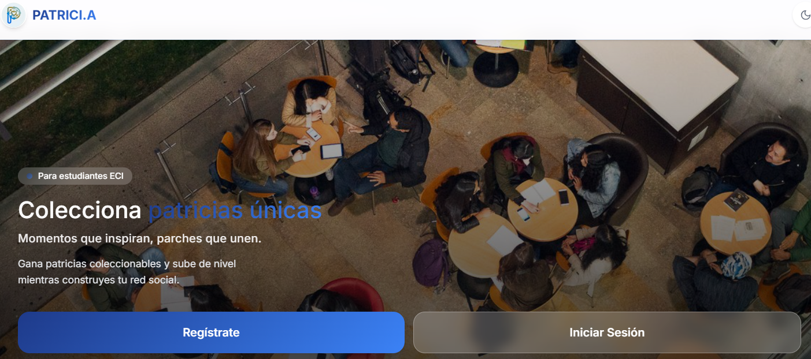

*Logo oficial del proyecto Patricia (EciBuddy)*

[Revisar manual de identidad visual](/docs/MANUAL_IDENTIDAD.md)

### Diseño en Figma
[Acceder al prototipo completo en Figma](https://figma.com/your-project-link)

## Módulos funcionales

### 1. Módulo de autenticación

Gestiona el ingreso y registro de usuarios con múltiples opciones de autenticación.

**Funcionalidades:**
- Registro con correo electrónico
- Inicio de sesión con credenciales
- Recuperación de contraseña
- Control de acceso a funcionalidades del sistema

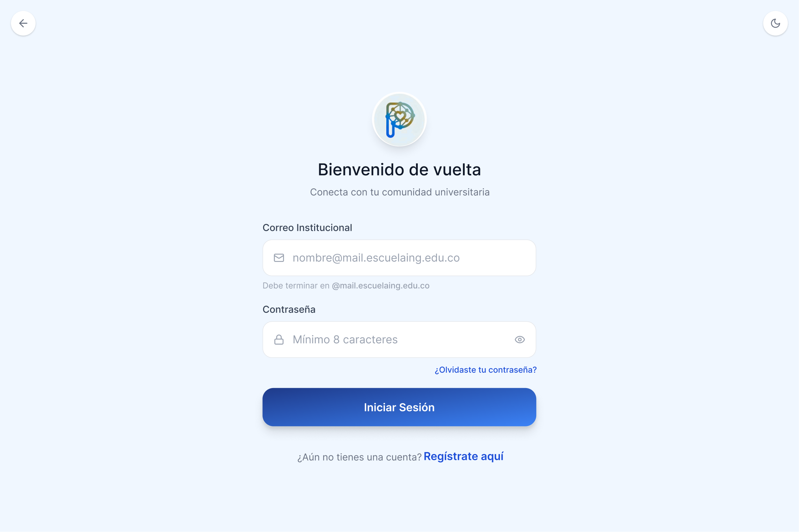
*Pantalla de inicio de sesión - Acceso a la plataforma*


*Pantalla de registro - Creación de nueva cuenta*


*Pantalla de verificación de correo - Validación del acceso institucional*


*Pantalla de perfil académico - Información académica básica*


*Pantalla de intereses - Selección de preferencias*


*Pantalla de recuperación de contraseña - Solicitud de instrucciones*


*Pantalla de restablecimiento de contraseña - Cambio de clave*

### 2. Módulo de dashboard

Vista principal personalizada que proporciona recomendaciones y visibilidad de la comunidad.

**Funcionalidades:**
- Recomendaciones de estudiantes ("Perfect Matches") basadas en intereses
- Feed de actividades de la comunidad ("University Pulse")
- Accesos rápidos a funcionalidades principales
- Resumen de información relevante del usuario

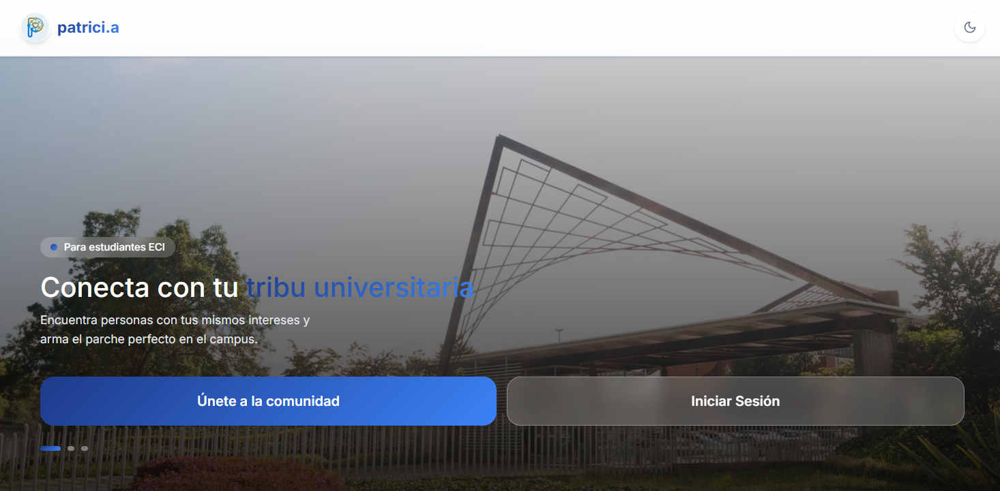
*Vista principal - Recomendaciones y actividad de comunidad*

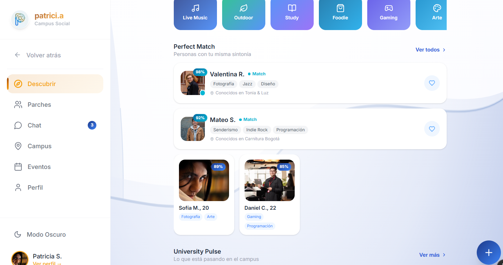
*Sección de Perfect Matches - Conexiones sugeridas*

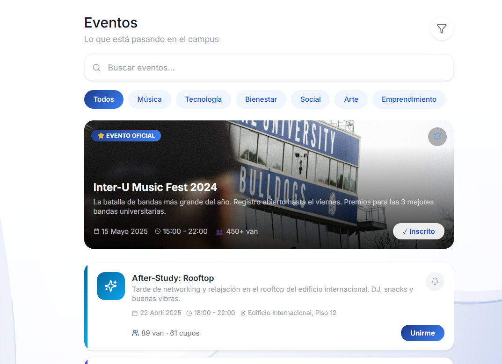
*University Pulse - Actividad reciente de la comunidad*

### 3. Módulo de gestión de parchas

Permite crear, visualizar, buscar y unirse a grupos de estudio y entretenimiento.

**Funcionalidades:**
- Crear nuevas parchas con categorización (Académicas, Sociales, Deportes)
- Visualizar listado de parchas disponibles
- Detalles de cada parcha (miembros, descripción, actividades)
- Buscar y filtrar parchas por categoría e intereses
- Sistema de solicitud para unirse a parchas

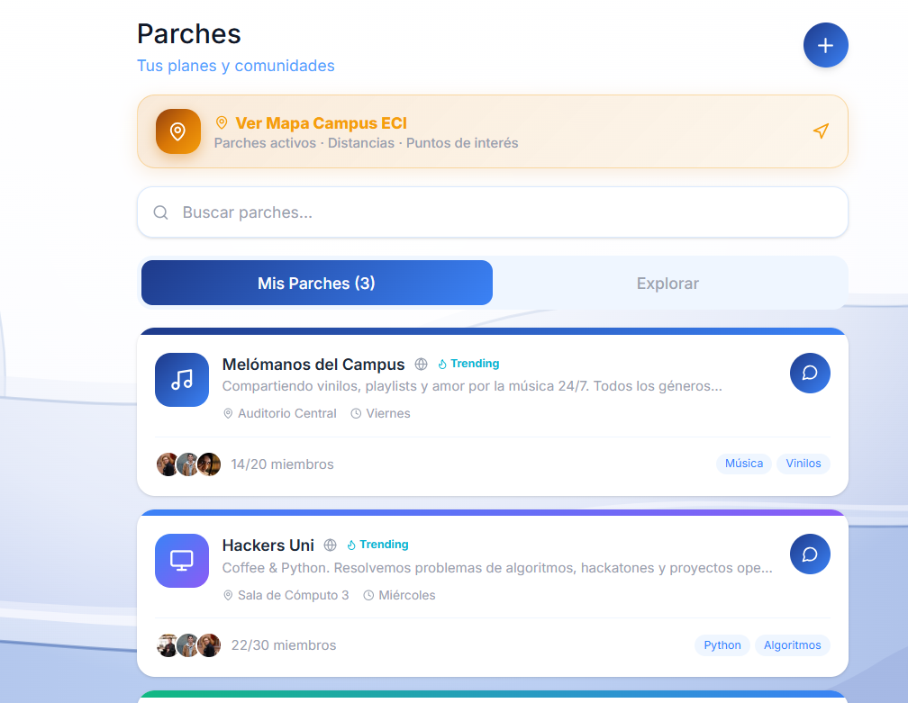*Catálogo de parches - Búsqueda y descubrimiento*

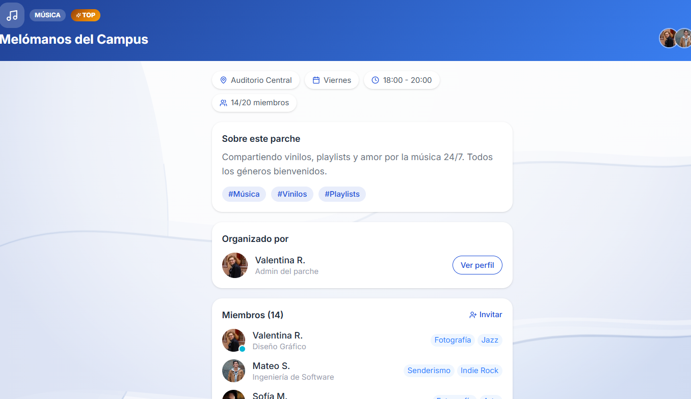
*Vista detallada - Información de miembros y actividades*

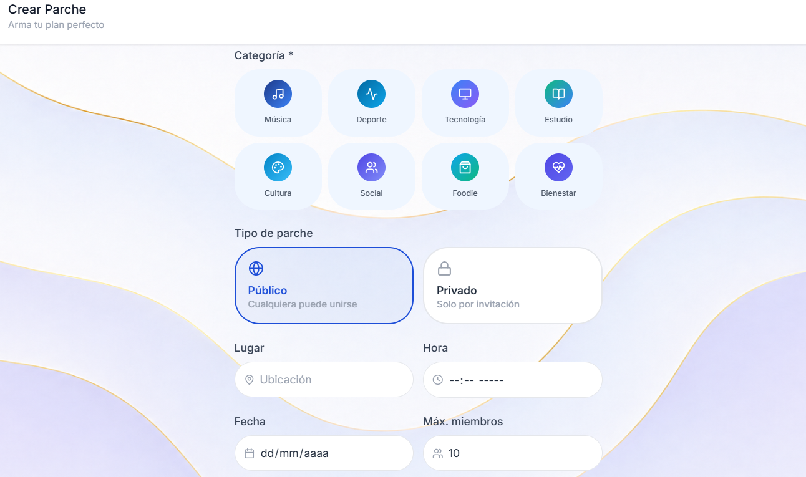*Formulario de creación - Configuración de nueva parcha*


### 4. Módulo de perfil

Visualización y edición del perfil de usuario con seguimiento de progreso social.

**Funcionalidades:**
- Información completa del perfil
- Social Progress: puntos de experiencia (XP) y eventos asistidos
- Historial de clubes y parchas
- Logros y milestones alcanzados
- Galería de fotos y multimedia
- Edición de preferencias e intereses

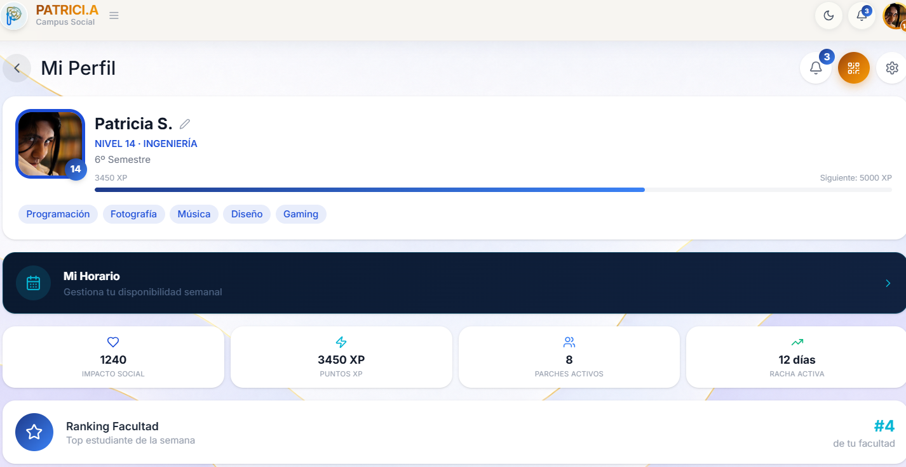
*Vista principal del perfil - Información y estadísticas básicas*


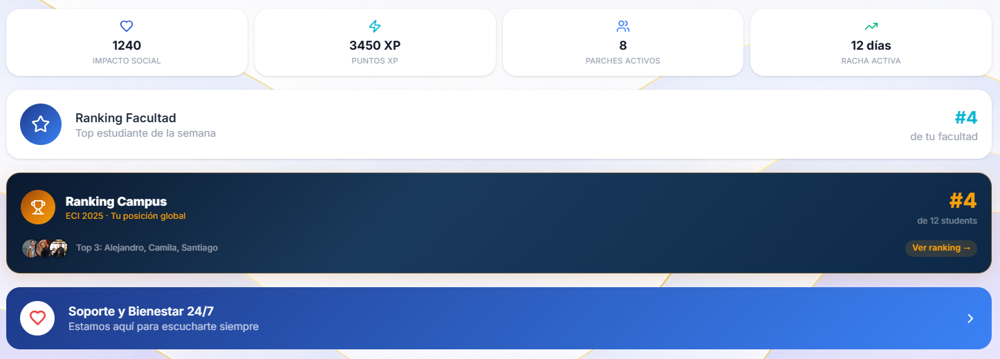
*Sección de milestones - Logros desbloqueados*

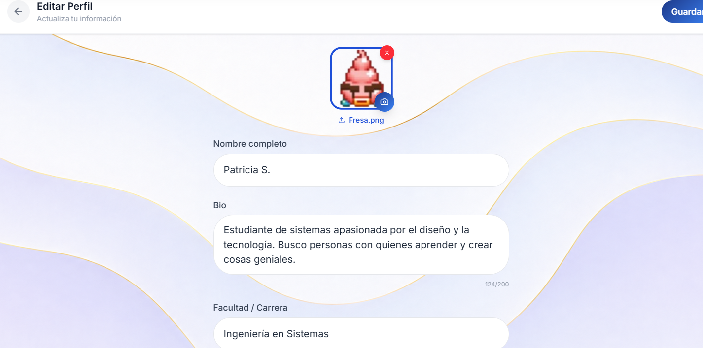
*Formulario de edición - Actualización de información*

### 5. Módulo de geolocalización

Herramienta de mapeo que permite visualizar y gestionar eventos en la universidad de forma espacial.

**Funcionalidades:**
- Visualización interactiva de eventos en el mapa de la universidad
- Activar/desactivar geolocalización para ver tu ubicación actual
- Filtrado de eventos por categoría, distancia y disponibilidad
- Vista de eventos activos cercanos a tu ubicación


*Mapa de eventos - Visualización interactiva de la universidad*

## Decisiones técnicas

El proyecto utiliza tecnologías modernas de frontend para asegurar escalabilidad, mantenibilidad y rendimiento óptimo. Cada herramienta fue seleccionada basándose en las mejores prácticas de la industria.

## Convenciones de código

**Nombres de componentes:** PascalCase
```typescript
// ✓ Correcto
export const UserProfile = () => { }
export const NavigationBar = () => { }

// ✗ Incorrecto
export const userProfile = () => { }
```

**Nombres de archivos:** kebab-case para archivos, PascalCase para componentes
```
src/components/
├── user-profile.tsx      // archivo
├── UserProfile.tsx       // componente
├── hooks/
│   └── use-auth.ts       // custom hook
```

**Variables y funciones:** camelCase
```typescript
const userEmail = "";
const calculateTotalPrice = () => { }
```

**Constantes:** UPPER_SNAKE_CASE
```typescript
const API_BASE_URL = "https://api.example.com";
const MAX_RETRY_ATTEMPTS = 3;
```

**Imports organizados:**
```typescript
// 1. Librerías externas
import React, { useState } from 'react';
import { useNavigate } from 'react-router-dom';

// 2. Componentes locales
import { Header } from '@/components/common/Header';
import { UserCard } from '@/components/user/UserCard';

// 3. Hooks personalizados
import { useAuth } from '@/hooks/use-auth';

// 4. Servicios y utilidades
import { userService } from '@/services/user-service';
import { formatDate } from '@/utils/date-utils';

// 5. Tipos
import type { User } from '@/types/user';

// 6. Estilos
import styles from './component.module.css';
```

## Gestión de estado

Se recomienda utilizar una de las siguientes estrategias según la complejidad:

**Context API + Hooks:** Para estado global simple
```typescript
export const AuthContext = createContext<AuthContextType | undefined>(undefined);

export const useAuth = () => {
  const context = useContext(AuthContext);
  if (!context) {
    throw new Error('useAuth debe ser usado dentro de AuthProvider');
  }
  return context;
};
```

**Zustand o Redux Toolkit:** Para estado global complejo con múltiples acciones

## Integración con API

Los servicios API se centralizan en la carpeta `src/services/`. Utilizar Fetch API o Axios con gestión de errores:

```typescript
// src/services/user-service.ts
export const userService = {
  async getUser(id: string) {
    const response = await fetch(`${API_BASE_URL}/users/${id}`);
    if (!response.ok) throw new Error('Failed to fetch user');
    return response.json();
  },

  async updateUser(id: string, data: UserUpdatePayload) {
    const response = await fetch(`${API_BASE_URL}/users/${id}`, {
      method: 'PUT',
      headers: { 'Content-Type': 'application/json' },
      body: JSON.stringify(data),
    });
    if (!response.ok) throw new Error('Failed to update user');
    return response.json();
  },
};
```

## Pruebas

La suite de pruebas utiliza Vitest y React Testing Library:

```bash
npm run test              # Ejecutar todas las pruebas
npm run test:watch       # Modo watch
npm run test:coverage    # Cobertura de pruebas
```

**Estructura de pruebas:**
```
src/
├── components/
│   ├── UserCard.tsx
│   └── __tests__/
│       └── UserCard.test.tsx
```

## Performance y optimización

- Lazy loading de rutas con `React.lazy()`
- Code splitting automático por Vite
- Optimización de imágenes (WebP, compresión)
- Memoización de componentes con `React.memo()` cuando sea necesario
- Eliminación de dependencias innecesarias en hooks

## Variables de entorno

Crear archivo `.env.local` en la raíz del proyecto:

```env
VITE_API_BASE_URL=http://localhost:8080/api
VITE_APP_NAME=Patricia
VITE_ENVIRONMENT=development
```

Acceder en el código:
```typescript
const apiUrl = import.meta.env.VITE_API_BASE_URL;
```

## Deployment

**Build para producción:**
```bash
npm run build
```

La carpeta `dist/` contiene los archivos compilados listos para producción.

**Opciones de hosting:**
- Vercel
- Netlify
- GitHub Pages
- AWS S3 + CloudFront
- Azure Static Web Apps

## Contribuir

Para contribuir al proyecto, por favor:

1. Consulta con el equipo de desarrollo
2. Sigue los estándares de código del proyecto
3. Asegúrate de que tu código pase validación y linting

---

## Documento de marketing

Breve introducción: el documento de marketing resume la propuesta de valor, público objetivo, mensajes clave y materiales visuales diseñados para promocionar Patricia (EciBuddy) dentro de la comunidad universitaria. Está pensado para que el equipo de producto y marketing coordinen campañas, landing pages y materiales para difusión en redes y eventos.


[Documento](<Estrategia De Marketing Y Publ 1.docx>)


Si el documento se encuentra en otra ubicación (por ejemplo PDF o carpeta compartida), reemplaza el enlace anterior por la ruta correcta o la URL externa correspondiente.

